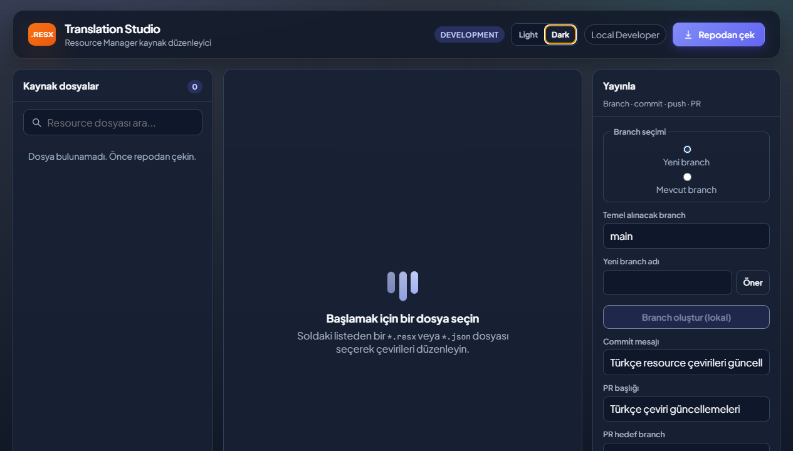

# Translation Tool

[English](README.md) | **Turkce**

Ekip ici web uygulamasi: Azure DevOps uzerindeki UI repo'sundaki resource dosyalarini listeler, duzenler, commit/push eder ve pull request olusturur.

Desteklenen resource dosyalari:

- `.resx`
- `.json`

JSON dosyalarda hem duz key-value hem de nested object yapisi desteklenir:

```json
{
  "Save": "Kaydet",
  "Home": {
    "Title": "Ana sayfa"
  }
}
```

Nested JSON degerleri UI'da `Home.Title` gibi gosterilir ve kaydedilirken mevcut nested yapi korunur.

## Demo



## Mimari

| Katman | Teknoloji |
|--------|-----------|
| Backend | ASP.NET Core 8 (`Translation.Api`) |
| Core | LibGit2Sharp, Azure DevOps REST API (`Translation.Core`) |
| Frontend | React + Vite (`web/translation-ui`) |
| Kimlik | Microsoft Entra ID (kurumsal SSO) |
| Git / PR | Azure DevOps PAT (sunucu tarafi) |

**Not:** SSO kullanicilarin uygulamaya girmesini saglar. Git clone/push ve PR islemleri icin sunucuda yapilandirilmis bir **Azure DevOps PAT** kullanilir. PAT'i Key Vault, ortam degiskeni veya User Secrets ile vermeniz onerilir.

## Hizli Baslangic

### 1. Backend Yapilandirmasi

`src/Translation.Api/appsettings.Development.json` veya User Secrets:

```json
{
  "AzureAd": {
    "Instance": "https://login.microsoftonline.com/",
    "TenantId": "<tenant-id>",
    "ClientId": "<api-app-client-id>",
    "Audience": "api://<api-app-client-id>"
  },
  "AzureDevOps": {
    "Organization": "your-org",
    "Project": "your-project",
    "Repository": "your-ui-repo",
    "DefaultBranch": "main",
    "PersonalAccessToken": "<pat-with-code-read-write-and-pr>"
  },
  "Workspace": {
    "RootPath": "C:\\translation-workspaces",
    "ResxSearchPattern": "*.resx;*.json"
  }
}
```

`Workspace:ResxSearchPattern` noktali virgul veya virgul ile birden fazla pattern alabilir. Varsayilan deger `*.resx;*.json` oldugu icin hem RESX hem JSON resource dosyalari listelenir.

Uygulama resource olmayan yaygin JSON dosyalarini disarida birakir: `package.json`, `package-lock.json`, `tsconfig*.json`, `node_modules`, `bin`, `obj`, `dist`, `build`.

`AzureAd:TenantId` bos birakilirsa gelistirme modunda otomatik kimlik dogrulama kullanilir.

```bash
cd src/Translation.Api
dotnet user-secrets init
dotnet user-secrets set "AzureDevOps:PersonalAccessToken" "<pat>"
dotnet run
```

Uygulama arayuzu: `https://localhost:7297`  
Swagger: `https://localhost:7297/swagger`

### 2. Entra ID (SSO)

1. **API uygulamasi** kaydi: `Translation.Api`, scope `access_as_user`
2. **SPA uygulamasi** kaydi: `translation-ui`, redirect `http://localhost:5173`
3. SPA'ya API scope izni verin
4. Frontend `.env`:

```env
VITE_AZURE_AD_TENANT_ID=...
VITE_AZURE_AD_CLIENT_ID=<spa-client-id>
VITE_AZURE_AD_API_SCOPE=api://<api-client-id>/access_as_user
```

### 3. Frontend

**Uretim / tek komut (API ile birlikte):**

```bash
cd web/translation-ui
npm install
npm run build
cd ../../src/Translation.Api
dotnet run
```

Tarayici dogrudan ceviri arayuzunu acar.

**Gelistirme (hot reload):**

```bash
# Terminal 1
cd src/Translation.Api && dotnet run

# Terminal 2
cd web/translation-ui && npm run dev
```

UI: `http://localhost:5173`  
API proxy: `https://localhost:7297`

## API Ozeti

Mevcut endpoint adlari geriye uyumluluk icin `/api/resx` olarak kalmistir; ancak artik `.resx` ve `.json` resource dosyalarini birlikte destekler.

| Method | Endpoint | Aciklama |
|--------|----------|----------|
| GET | `/api/resx` | Repodaki desteklenen resource dosyalarini listeler |
| GET | `/api/resx/{path}` | Resource dosyasi icerigi |
| PUT | `/api/resx/{path}` | Resource dosyasini gunceller |
| POST | `/api/git/pull` | `git pull` |
| GET | `/api/git/branches` | Branch listesini getirir |
| GET | `/api/git/branch-defaults` | Varsayilan branch bilgilerini getirir |
| POST | `/api/git/branches` | Lokal branch olusturur veya checkout eder |
| POST | `/api/git/commit-push` | Commit + push |
| POST | `/api/pull-requests` | Azure DevOps PR olusturur |
| GET | `/api/me` | Oturum bilgisi |

## Uretim Notlari

- PAT'i ortam degiskeni veya Key Vault'tan okuyun; repoya commit etmeyin.
- `Workspace:RootPath` icin kalici disk ve yedekleme planlayin.
- IIS / Azure App Service kullanirken ayni Entra tenant SSO ayarlarini dogrulayin.
- CORS `Cors:Origins` ile UI origin'inizi ekleyin.
- JSON resource dosyalarinda string olmayan degerler UI'da duzenlenmez; nested object altindaki string degerler duzenlenir.

## GitHub Pages

Repoda `.github/workflows/pages.yml` altinda React UI'yi GitHub Pages'e deploy eden bir GitHub Actions workflow'u bulunur. Bu workflow README'yi degil, UI build ciktisini yayinlar.

GitHub'da **Settings -> Pages** ekranina gidin ve **Source** alanini **GitHub Actions** olarak secin. `main` veya `development` branch'e her push geldiginde workflow `web/translation-ui` projesini build eder ve uretilen `dist` klasorunu deploy eder.

GitHub Pages sadece statik UI yayinlar. ASP.NET API ayri bir yerde host edilmelidir. API baska bir domainde host ediliyorsa repoya `VITE_API_BASE_URL` isimli variable ekleyin, ornegin:

```text
https://translation-api.example.com
```
